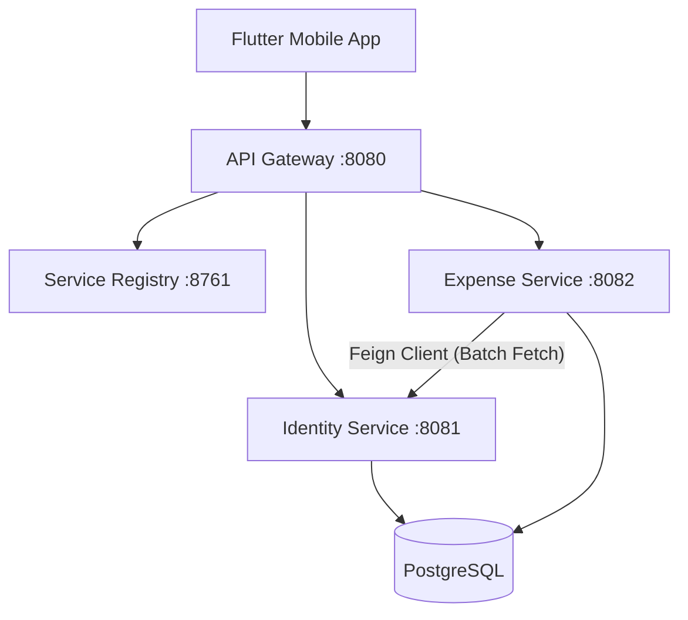

# Split & Track - Microservices Backend

   

**Split & Track** is a distributed expense splitting system (similar to Splitwise) built using a scalable **Microservices Architecture**. It enables users to create groups, split expenses (equally or unequally), and settle debts efficiently.

The system is decomposed into domain-driven services, orchestrated via **Netflix Eureka** and accessible through a unified **API Gateway**.

## 🏗️ System Architecture

The application is split into the following independent microservices:

| Service Name | Port | Responsibility |
| :--- | :--- | :--- |
| **Service Registry** | `8761` | Netflix Eureka Server for Service Discovery. |
| **API Gateway** | `8080` | Single entry point. Handles routing (`/api/auth` -\> Identity, `/api/groups` -\> Expense) and load balancing. |
| **Identity Service** | `8081` | Manages User Registration, Login, JWT Generation, and "Shadow Account" invitations. |
| **Expense Service** | `8082` | Core logic for Groups, Expenses, Splits, and Balance Calculation. |
| **PostgreSQL** | `5432` | Relational database sharing data storage (logical separation via schemas/tables). |

### Infrastructure Diagram



## 🚀 Key Features

  * **Microservices Architecture:** Fully decoupled services allowing independent scaling and deployment.
  * **Centralized Routing:** Spring Cloud Gateway routes traffic dynamically based on service registration status.
  * **Distributed Security:** Stateless authentication using JWT. Secure inter-service communication achieved via custom **Feign Request Interceptors** that propagate tokens downstream.
  * **Performance Optimization:** Solved the N+1 network latency problem in balance calculations by implementing a **Batch Data Fetching** pattern, reducing inter-service calls by \~95% for large groups.
  * **Shadow Accounts (Lazy Registration):** Users can invite friends via email. The system creates a "Shadow Account" that merges automatically when the user officially registers later.
  * **Complex Splitting:** Supports Equal and Unequal expense splitting logic.

## 🛠️ Tech Stack

  * **Language:** Java 17
  * **Framework:** Spring Boot 3
  * **Cloud Stack:** Spring Cloud (Gateway, Eureka, OpenFeign)
  * **Database:** PostgreSQL
  * **Containerization:** Docker & Docker Compose
  * **Build Tool:** Maven (Multi-Module Project)

## ⚙️ Getting Started

### Prerequisites

  * Docker & Docker Compose
  * Java 17 JDK (Only if running manually)
  * Maven

### Option 1: Run with Docker (Recommended)

This spins up the entire ecosystem (Database + 4 Services) with one command.

1.  **Clone the repository:**

    ```bash
    git clone https://github.com/your-username/split-and-track-backend.git
    cd split-and-track-backend
    ```

2.  **Build the JAR artifacts:**

    ```bash
    mvn clean package -DskipTests
    ```

3.  **Start the Cluster:**

    ```bash
    docker-compose up --build
    ```

4.  **Verify Deployment:**

      * **Eureka Dashboard:** [http://localhost:8761](https://www.google.com/search?q=http://localhost:8761) (Check if all services are UP)
      * **API Gateway:** [http://localhost:8080](https://www.google.com/search?q=http://localhost:8080)

### Option 2: Run Manually (For Development)

You must start the services in this specific order:

1.  Start local PostgreSQL (`postgres:password` on port 5432).
2.  Run `ServiceRegistryApplication` (Port 8761).
3.  Run `IdentityServiceApplication` (Port 8081).
4.  Run `ExpenseServiceApplication` (Port 8082).
5.  Run `ApiGatewayApplication` (Port 8080).

## 🔌 API Endpoints

All requests should be sent to the **API Gateway (Port 8080)**.

### Identity Service

  * `POST /api/auth/register` - Create a new account.
  * `POST /api/auth/login` - Authenticate and get JWT.
  * `POST /api/users/invite` - Invite a user via email (Shadow Account).

### Expense Service

  * `GET /api/groups/user/{userId}` - Get all groups for a user.
  * `POST /api/groups/create` - Create a new group.
  * `POST /api/expenses` - Add a new expense (Equal/Unequal split).
  * `GET /api/groups/{groupId}/balances/{userId}` - Get net balances (Who owes whom).

## 📝 Configuration

### Environment Variables

The `docker-compose.yml` file handles most configuration. However, if you want to enable Email Notifications, update the `identity-service` environment variables:

```yaml
    environment:
      - SPRING_MAIL_USERNAME=your-email@gmail.com
      - SPRING_MAIL_PASSWORD=your-app-password
```

## 🔮 Future Roadmap

  * [ ] **Notification Service:** Decouple email sending using Apache Kafka.
  * [ ] **Resilience:** Implement Circuit Breakers (Resilience4j) for Identity Service downtime.
  * [ ] **Monitoring:** Add Distributed Tracing with Zipkin/Micrometer.

-----

*Built by Rupesh | 2025*